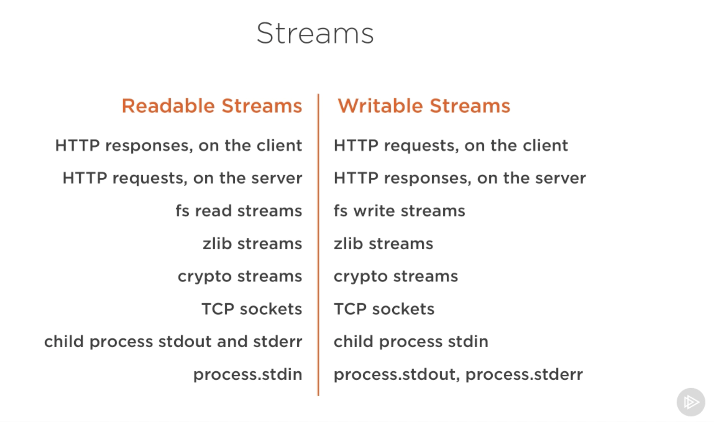
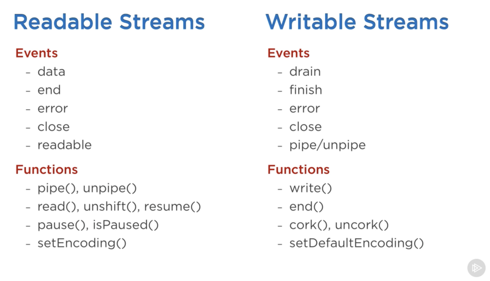

## Full Stack Web Development Bootcamp @Otoño2017

## ~ 20171023

### Node

- Debugging con node:
    ```bash
    $ node debug <file>
    debug> sb(<line>)
    debug> cont
    debug> exex <variable>
    ```

- Inspeccionar el código en _Chrome Developer Tools_:
    ```bash
    $ node --inspect --debug-brk <file>
    ```

- Node *devtools*:
    ```bash
    $ npm install -g devtool
    $ devtool --brake <file>
    ```

- Contexto global de node (~ como window en el explorador): *global*.

- *global.process*: The process object is a global that provides information about, and control over, the current Node.js process. As a global, it is always available

- *process.argv*: acceso a los argumentos de llamada del script: _node script.js arg1 arg2_

- *process.env*: acceso a las variables de entorno del sistema, tales como _PATH_, etc...

- File system: *require('fs')* ~ podemos trabajar de forma sincrona o asincrona.
    + _fs.readFileSync_ vs. _fs.readFile_
    + _fs.writeFileSync_ vs. _fs.writeFile_
    + _fs.lstatSync_ vs. _fs.lstat_
    ...

- Trabajando con _path_
    ```javascript
    const path = require('path')
    path.join(dir, file)
    ```

- Http: *require('http')*
    ```javascript
    const http = require('http')
    
    const server = http.createServer()
    
    server.on('request', function(req, res) {
        res.end('Hello world!')
    })

    server.listen(3000)
    ```

- [Streams][link] && pipes -> [stream-adventure][stream-adventure]
    
    

[link]: https://medium.freecodecamp.org/node-js-streams-everything-you-need-to-know-c9141306be93
[stream-adventure]: https://github.com/workshopper/stream-adventure
